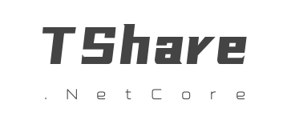
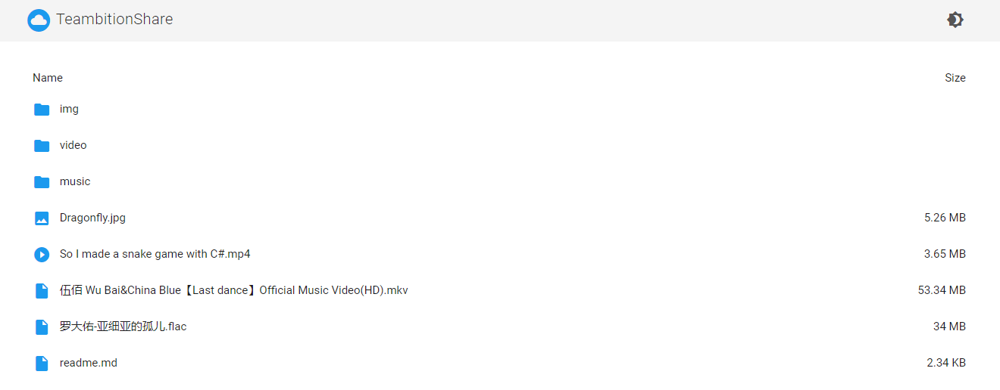
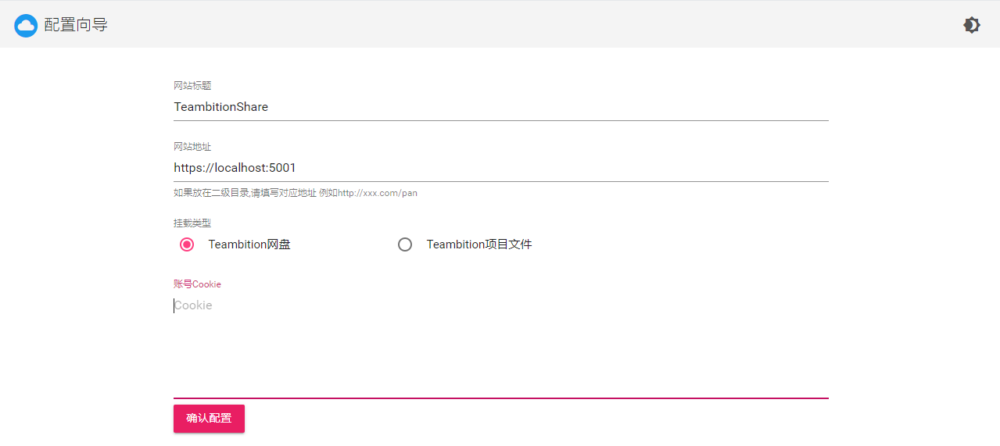

  

# [TeambitionShare.Net](https://github.com/BlueHtml/TeambitionShare.Net)

挂载Teambition文件(网盘文件列表程序) ，已支持Teambition网盘(需申请)与Teambition项目

本项目移植自[TeambitionShare](https://github.com/FlxSNX/TeambitionShare)，修改后使其运行在 .Net Core 上

## 开发者信息

本应用由 [BlueHtml](https://github.com/BlueHtml) 开发提供（原项目作者：[FlxSNX](https://github.com/FlxSNX)）

## 使用

在没有配置文件时访问网站会跳转到配置向导，在配置向导页面填写对应的参数即可生成配置文件，如下图：

### 获取cookie

先去 www.teambition.com 注册登录，然后获取Cookie:  
F12 -> Network -> 刷新一下 找到如图所示的cookie  
  

### 获取项目ID(projectId) 

先创建一个项目,然后进入创建的项目  
  
  

## 部署

本项目基于腾讯开源项目 [CloudBase Framework](https://github.com/Tencent/cloudbase-framework)  开发部署，支持一键云端部署

### 配置

无

### 依赖

- CFS：使用 CFS 持久化存储数据

## 注意事项

1. 部署时，需要将服务路径设置为根路径 `/`
2. 建议使用 0.5C 1G 以上的规格
3. 更多设置请参考[TeambitionShare](https://github.com/FlxSNX/TeambitionShare)

## 文档

- [CloudBase Framework 文档](https://docs.cloudbase.net/framework/)
- [TeambitionShare](https://github.com/FlxSNX/TeambitionShare/blob/master/readme.md)

## Licence

开源协议文档请参阅 [LICENSE](https://github.com/BlueHtml/TeambitionShare.Net/blob/master/LICENSE)
